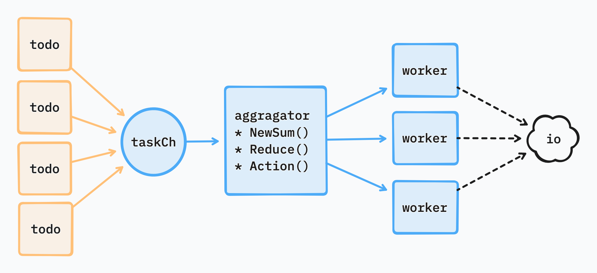

# Aggregator

This is a generic batch processing library for golang. 
You can group up and process batch of tasks into group or groups, which can help us to reduce loading of io.

### Beta

This project may contain bugs and have not being tested at all. Please feel free to test, improve it.

### Golang

golang v1.18+ required

## Examples

* [simple](./example/simple/main.go)
* [mset](./example/mset/main.go)

### there are many practical use cases in real world

* sync a bulk of documents into elasticsearch
* write cache into redis by pipeline
* write grouped quota data into redis by hmset
* write metrics into clickhouse by batch (10K+)

## How
There is 3 type need to define on your own before init aggregator, which is even more important than aggregator functions.

- T: task type - the original task waiting to group up.
- U: the grouped type - each work will gather tasks into this type before flush (really handler them in batch).
- V: the result type - the result of each flush action.

## Inspiration

- [API Performance Tunning Story when Golang meet with GraphQL](https://hackmd.io/zvmgdunRR8mjAjVIMx0eDA?both)
- [gobatch](https://github.com/herryg91/gobatch)
- [aggregator](https://github.com/serkodev/aggregator)

## LICENSE

MIT lo
